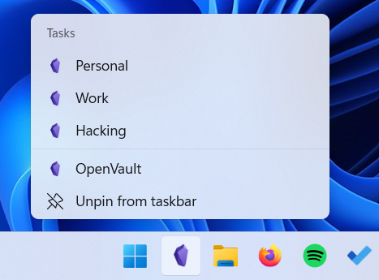

# OpenVault
[Obsidian](http://obsidian.md) is a awesome tool for note taking and creating a so called "second brain". However, it lacks a bit of a vault management and may be a bit frustrating to launch a particular vault at times (especially if like me, you change the vaults frequently). This app solves the issue.

This application implements a tray icon that let's you choose your desired vault. Simply by starting the application the tray icon is spawned automatically.


Additionally, if you want to have the app on the taskbar and at the same time to have the option to choose the vault, with a right click on the app you can open a desired vault.



You can choose which one you want to use in the JSON config file.

Example configuraton:

```json
{
  "VaultNames": [ "Personal", "Work", "Hacking" ],
  "Tray": true,
  "Taskbar": false
}
````

# How to run (Tray version)
1. Compile the source in Visual Studio
2. Create a shortcut to the main binary
3. Open Win+r and type `shell:startup`
4. Copy the shortcut to the `shell:startup` directory

Now the OpenVault tray icon will start automatically every time you start your computer.

# How to run (Taskbar version)
1. Compile the source in Visual Studio
2. Add the app to the taskbar
3. Run the app for the first time (nothing is supposed to happen)
4. You can now right click the app and run any vault